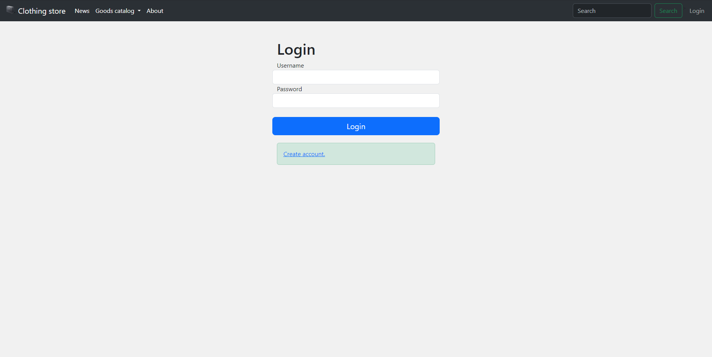
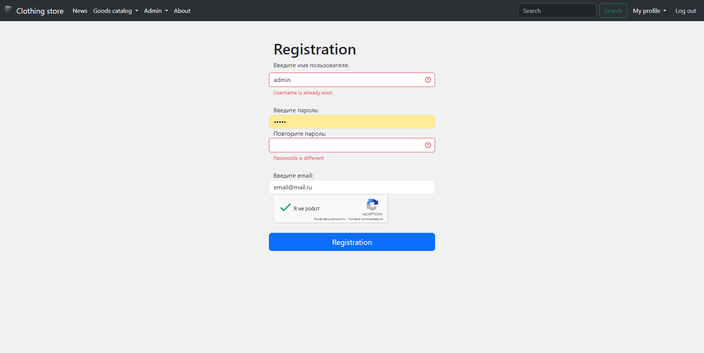
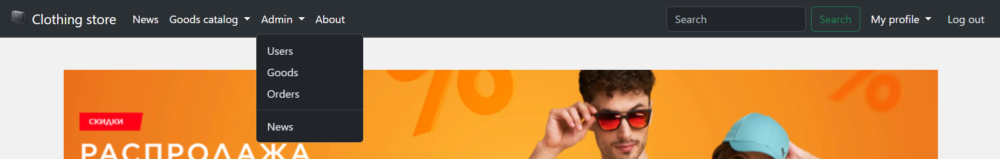
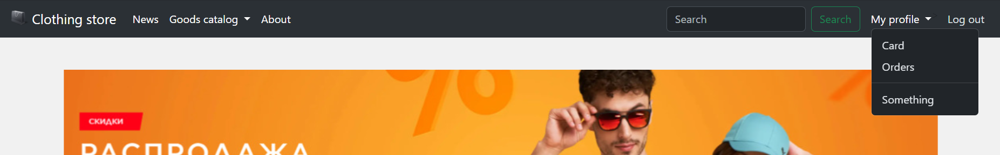
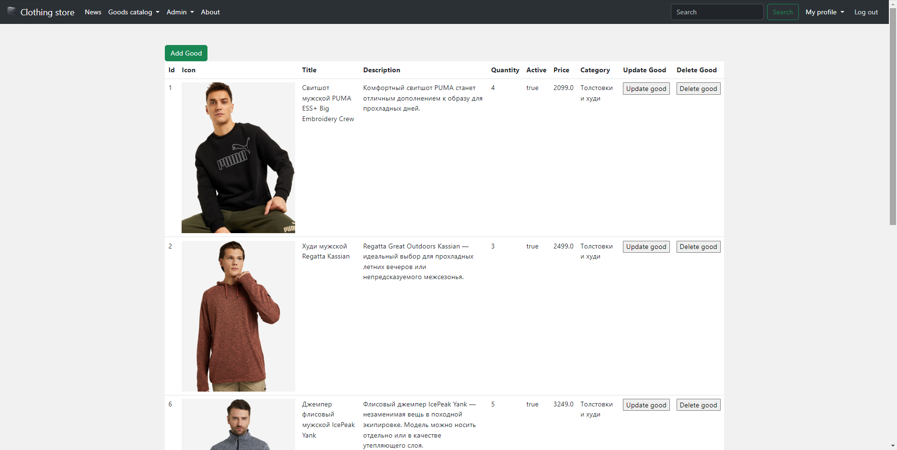
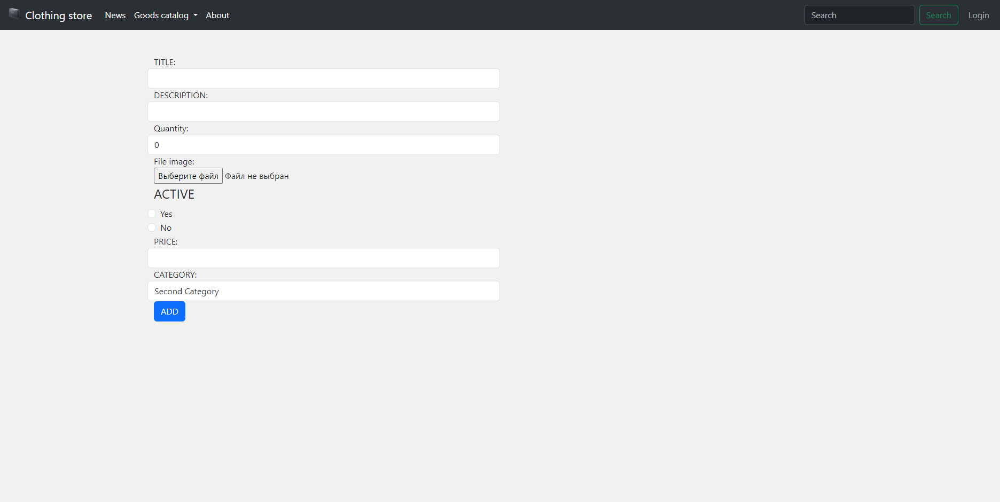
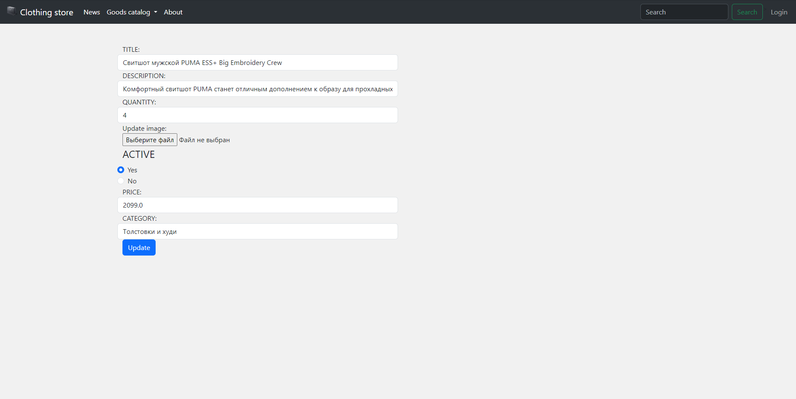

# Онлайн магазин на Java
Используемые технологии
* Spring Boot, MVC, Security, Data JPA
* Hibernate6
* База данных (PostgreSql)
* Thymeleaf5
* JS (native, jquery)
* Junit5
* Bootstrap5

## Возможности приложения
* Пользователь может зарегистрироваться / авторизоваться
* Пользователь может перейти в каталог товаров, на страницу детального просмотра товара
* Пользователь может перейти на страницу со списком новостей сайта, на страницу детального просмотра новости
* Пользователь может добавить товар в корзину, удалить товар из корзины,
 увеличить количество определенного наименования товара в корзине
* Пользователь может заказать товар, находящийся в корзине
* Пользователь в любой момент может просмотреть содержимое корзины и созданные ранее заказы
* Администратор может менять данные любого пользователя
* Администратор может изменять любой товар
* Администратор может изменять любые новости на сайте
* Администратор может менять состояние любого заказа, его статус
* Валидация полей, введенных пользователем
* При попадании на страницу, которой не существует или при возникновении ошибки пользователь видит кастомную страницу 404
* Товары подразделены на категории, в каждую категорию можно попасть из меню сайта
* Слайдер с последними новостями на главной странице сайта

## Скриншоты
### Главная страница сайта

### Страница авторизации
Страница авторизации      |  Страница регистрации
:------------------------:|:-------------------------:
  |  

### Валидация полей

### Вид меню
Меню администратора      |  Меню пользователя
:------------------------:|:-------------------------:
  |  

### Страница каталога

### Круд товаров
Индекс      |  Страница добавления товара
:------------------------:|:-------------------------:
  |  
Страница редактирования      |  Удаление товара
  |  